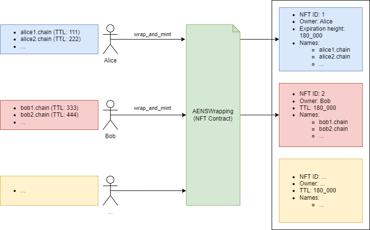
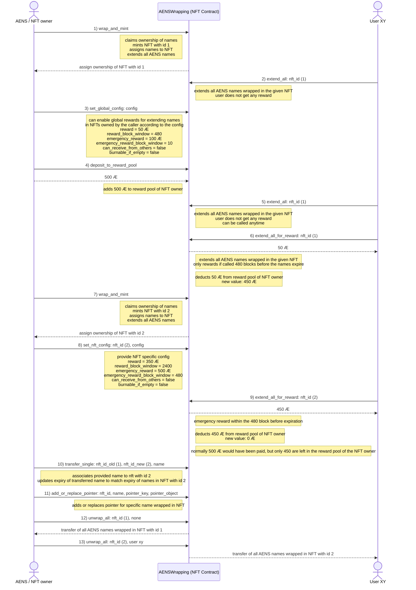

# Introduction
The work in this repository is part of a [grant approved by the æternity crypto foundation](https://forum.aeternity.com/t/active-wrapping-aens-names-into-aex-141-nfts).

## Before the grant (status quo)

* No batch actions (updates, transfers) for AENS names are possible
* No trading of AENS names possible
* Users still suffer from name expiration as they fail to consistently track name expiration

## After the grant (result of this work)

Wrapping AENS names into NFTs will make it easy to perform batch-actions on the names and enable new use cases. NFT trading is also highly anticipated and is another topic to tackle in that regards.

The results of the work in this grant will:

* provide a way for the community to better manage their AENS names
* enable batch-actions for AENS names
* allow strangers to extend AENS names and get rewarded for that
* make AENS names easily tradable on NFT marketplaces

## Simple explainer
By calling the entrypoint `wrap_and_mint`, users can wrap up to 100 AENS names (`name_limit` configured during deployment of the contract) into an NFT.

The AENSWrapping contract syncs the expiration of all wrapped AENS names by extending all of them with the `max_name_ttl` (configured during deployment of the contract).

Every user can:

* create as many NFTs as they want and thus wrap as many AENS names as they want
* wrap/unwrap AENS names into/from existing NFTs that they own
* add or replace pointer(s) of a specific AENS name that is wrapped into an NFT that they own
* revoke AENS names that are wrapped into NFTs that they own
* transfer NFTs (and thus also the wrapped AENS names) to other users
* define a global config to define:
    * reward (incl. reward block window) for other users for extending their names
    * emergency-reward (incl. emergency reward block window) for other users for extending their names
    * if other users can transfer AENS names into NFTs that they own
    * if other users can burn NFTs that they own in case they are empty
* define a similar config for each NFT they own (overrrules the global config)
* deposit AE to the reward pool in order to reward other users for extending their names
* withdraw of AE from the reward pool
* extend all AENS names wrapped into a specific NFT (no matter if they own it or not) by calling:
    * `extend_all` (no reward, good will)
    * `extend_all_for_reward` (rewards the user in case there is a reward configured, the reward block window is reached and the owner of the NFT has AE deposited to the reward pool)

## Full example sequence

## Contracts

### Iris (current protocol version)

[AENSWrapping.aes](./development/smart-contracts/contracts/AENSWrapping.aes)

* implements [IAEX141](./development/smart-contracts/contracts/interfaces/IAEX141.aes) interface as defined in the [AEX-141 NFT Standard](https://github.com/aeternity/AEXs/blob/master/AEXS/aex-141.md)
* implements [IAENSWrapping](./development/smart-contracts/contracts/interfaces/IAENSWrapping.aes) interface
* provides a migration path for a future deployment of [AENSWrappingCeres.aes](./development/smart-contracts/contracts/AENSWrappingCeres.aes) to allow a seamless migration to the new contract
    * the creator of the contract will be the `admin` that can optionally define a `deployer` of the future Ceres contract

Tests & artifacts:

* [aensWrappingTest-iris.js](./development/smart-contracts/test/aensWrappingTest-iris.js) (tests written in JavaScript using [AEproject](https://github.com/aeternity/aeproject))
* [aci-iris.json](./development/smart-contracts/generated_artifacts/aci-iris.json) (contract interface generated via [generateBytecodeAndAci-iris.js](./development/smart-contracts/scripts/generateBytecodeAndAci-iris.js))
* [bytecode-iris](./development/smart-contracts/generated_artifacts/bytecode-iris) (contract bytecode generated via [generateBytecodeAndAci-iris.js](./development/smart-contracts/scripts/generateBytecodeAndAci-iris.js))

### Ceres (future protocol version)

[AENSWrappingCeres.aes](./development/smart-contracts/contracts/AENSWrappingCeres.aes)

* implements [IAEX141](./development/smart-contracts/contracts/interfaces/IAEX141.aes) interface as defined in the [AEX-141 NFT Standard](https://github.com/aeternity/AEXs/blob/master/AEXS/aex-141.md)
* implements [IAENSWrappingCeres](./development/smart-contracts/contracts/interfaces/IAENSWrappingCeres.aes)
* activates the migration path from Iris contract to itself during deployment
* provides an easy way for users to migrate an NFT from the old Iris contract to itself
* simplifies delegation signature handling
    * requires only one global delegation signature for all existing as well as future AENS names owned by a specific user
    * no need to pass a specific delegation signature for each AENS name

Tests & artifacts:

* [aensWrappingTest-ceres.js](./development/smart-contracts/test/aensWrappingTest-ceres.js) (tests written in JavaScript using [AEproject](https://github.com/aeternity/aeproject))
* [aci-ceres.json](./development/smart-contracts/generated_artifacts/aci-ceres.json) (contract interface generated via [generateBytecodeAndAci-ceres.js](./development/smart-contracts/scripts/generateBytecodeAndAci-ceres.js))
* [bytecode-ceres](./development/smart-contracts/generated_artifacts/bytecode-ceres) (contract bytecode generated via [generateBytecodeAndAci-ceres.js](./development/smart-contracts/scripts/generateBytecodeAndAci-ceres.js))

## Sponsors

This work is sponsored by the [æternity crypto foundation](https://www.aeternity-foundation.org).

Do you also wanna sponsor this work? Send some Æ coins to:

- [`buymeacoffee.chain`](https://aescan.io/names/buymeacoffee.chain) or
- [`ak_3mw4DAv1mbo8XbEjTgt8UgWTgGJoNmiRnvCywz4BD6192kHtm`](https://aescan.io/accounts/ak_3mw4DAv1mbo8XbEjTgt8UgWTgGJoNmiRnvCywz4BD6192kHtm)