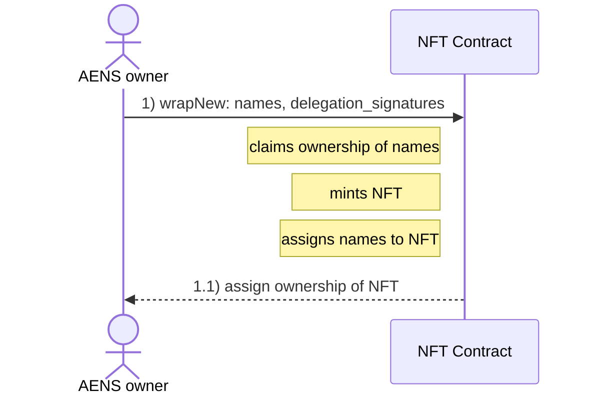
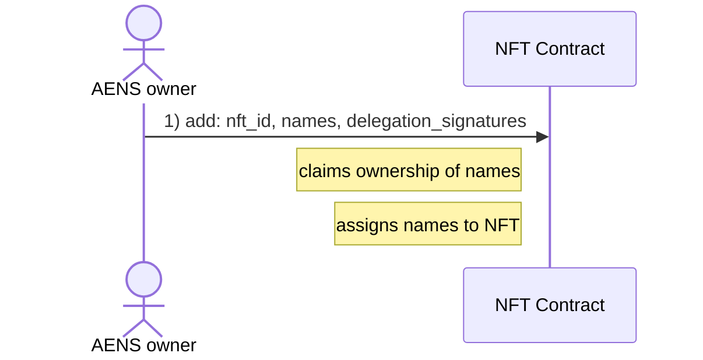

# Wrapping AENS names

## Wrapping names by minting a new NFT

```mermaid
sequenceDiagram
    actor AENS owner
    AENS owner ->> NFT Contract: 1) wrapNew: names, delegation_signatures
    Note left of NFT Contract: claims ownership of names
    Note left of NFT Contract: mints NFT
    Note left of NFT Contract: assigns names to NFT
    NFT Contract -->> AENS owner: 1.1) assign ownership of NFT
```

**Discussion**

- Reward with AENS tokens?

## Add names to existing NFT

```mermaid
sequenceDiagram
    actor AENS owner
    AENS owner ->> NFT Contract: 1) add: nft_id, names, delegation_signatures
    Note left of NFT Contract: claims ownership of names
    Note left of NFT Contract: assigns names to NFT
```

**Discussion**

- Reward with AENS tokens?