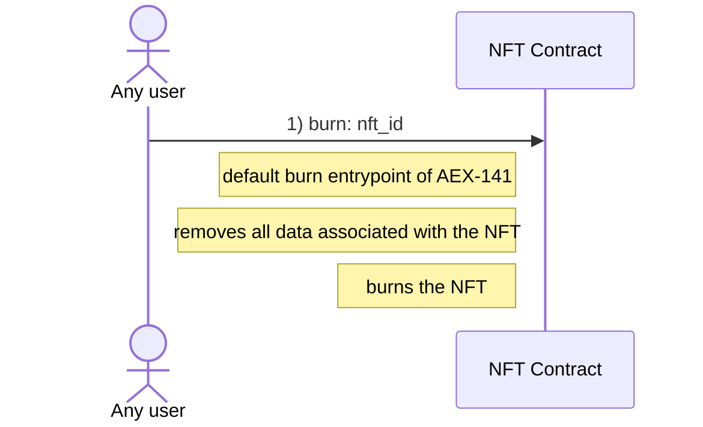
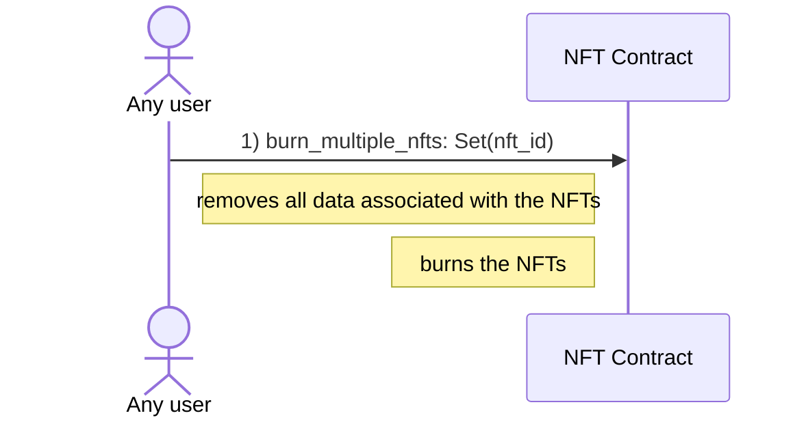

# Explicit Burn of NFTs

Note:

- Burning NFTs is only possible if the wrapped AENS names are expired OR if the NFT is empty, meaning it does not wrap an AENS name
- The burn entrypoint is part of the AEX-141 standard and can be called by any user
- If the config of the NFT owner allows it, anybody can burn the NFT

## Single

## Multiple

