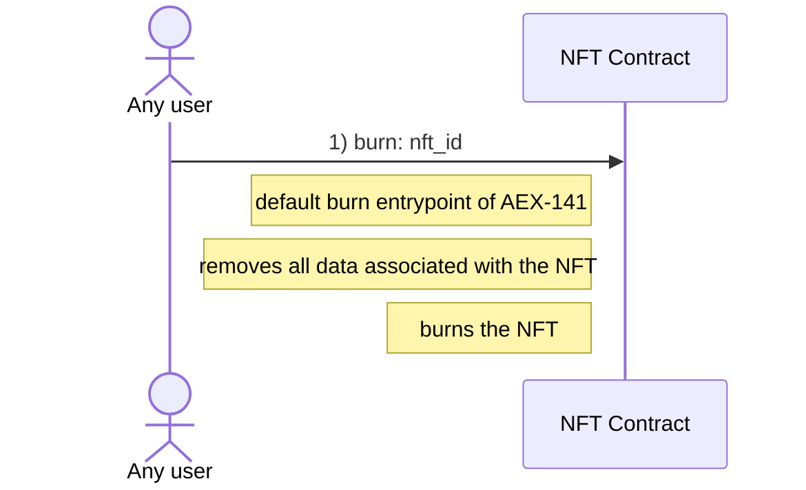
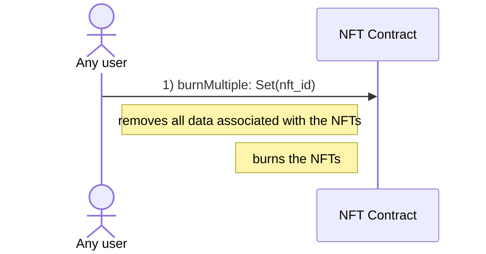

# Explicit Burn of NFTs

Note:

- Burning NFTs is only possible if the wrapped AENS names are expired
- The burn entrypoint is part of the AEX-141 standard and can be called by any user

## Single

## Multiple

