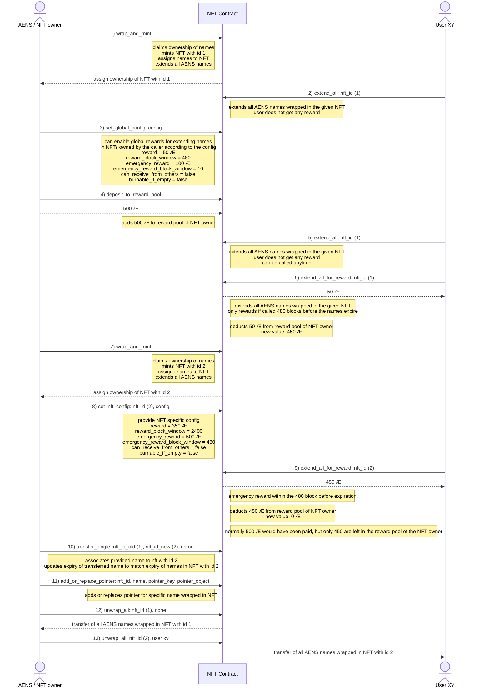

# Full example sequence

```mermaid
sequenceDiagram
    actor AENS / NFT owner

    AENS / NFT owner ->> NFT Contract: 1) wrap_and_mint
    Note left of NFT Contract: claims ownership of names<br />mints NFT with id 1<br />assigns names to NFT<br />extends all AENS names
    NFT Contract -->> AENS / NFT owner: assign ownership of NFT with id 1

    actor User XY

    User XY ->> NFT Contract: 2) extend_all: nft_id (1)
    Note right of NFT Contract: extends all AENS names wrapped in the given NFT<br /> user does not get any reward

    AENS / NFT owner ->> NFT Contract: 3) set_global_config: config
    Note left of NFT Contract: can enable global rewards for extending names<br />in NFTs owned by the caller according to the config<br />reward = 50 Æ<br />reward_block_window = 480<br />emergency_reward = 100 Æ<br />emergency_reward_block_window = 10<br />can_receive_from_others = false<br />burnable_if_empty = false

    AENS / NFT owner ->> NFT Contract: 4) deposit_to_reward_pool
    AENS / NFT owner -->> NFT Contract: 500 Æ
    Note left of NFT Contract: adds 500 Æ to reward pool of NFT owner

    User XY ->> NFT Contract: 5) extend_all: nft_id (1)
    Note right of NFT Contract: extends all AENS names wrapped in the given NFT<br /> user does not get any reward<br /> can be called anytime

    User XY ->> NFT Contract: 6) extend_all_for_reward: nft_id (1)
    NFT Contract -->> User XY: 50 Æ
    Note right of NFT Contract: extends all AENS names wrapped in the given NFT<br /> only rewards if called 480 blocks before the names expire
    Note right of NFT Contract: deducts 50 Æ from reward pool of NFT owner<br />new value: 450 Æ

    AENS / NFT owner ->> NFT Contract: 7) wrap_and_mint
    Note left of NFT Contract: claims ownership of names<br />mints NFT with id 2<br />assigns names to NFT<br />extends all AENS names
    NFT Contract -->> AENS / NFT owner: assign ownership of NFT with id 2

    AENS / NFT owner ->> NFT Contract: 8) set_nft_config: nft_id (2), config
    Note left of NFT Contract: provide NFT specific config<br />reward = 350 Æ<br />reward_block_window = 2400<br />emergency_reward = 500 Æ<br />emergency_reward_block_window = 480<br />can_receive_from_others = false<br />burnable_if_empty = false

    User XY ->> NFT Contract: 9) extend_all_for_reward: nft_id (2)
    NFT Contract -->> User XY: 450 Æ
    Note right of NFT Contract: emergency reward within the 480 block before expiration
    Note right of NFT Contract: deducts 450 Æ from reward pool of NFT owner<br />new value: 0 Æ
    Note right of NFT Contract: normally 500 Æ would have been paid, but only 450 are left in the reward pool of the NFT owner 
    
    AENS / NFT owner ->> NFT Contract: 10) transfer_single: nft_id_old (1), nft_id_new (2), name
    Note left of NFT Contract: associates provided name to nft with id 2<br />updates expiry of transferred name to match expiry of names in NFT with id 2

    AENS / NFT owner ->> NFT Contract: 11) add_or_replace_pointer: nft_id, name, pointer_key, pointer_object
    Note left of NFT Contract: adds or replaces pointer for specific name wrapped in NFT

    AENS / NFT owner ->> NFT Contract: 12) unwrap_all: nft_id (1), none
    NFT Contract -->> AENS / NFT owner: transfer of all AENS names wrapped in NFT with id 1

    AENS / NFT owner ->> NFT Contract: 13) unwrap_all: nft_id (2), user xy
    NFT Contract -->> User XY: transfer of all AENS names wrapped in NFT with id 2
```