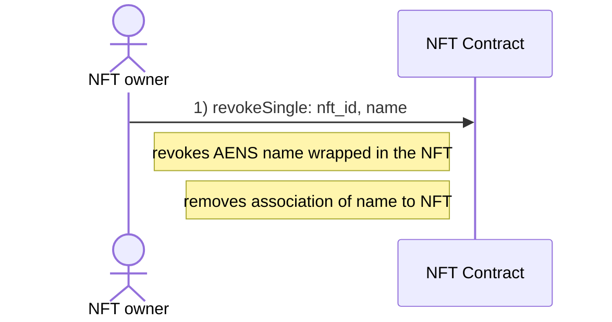
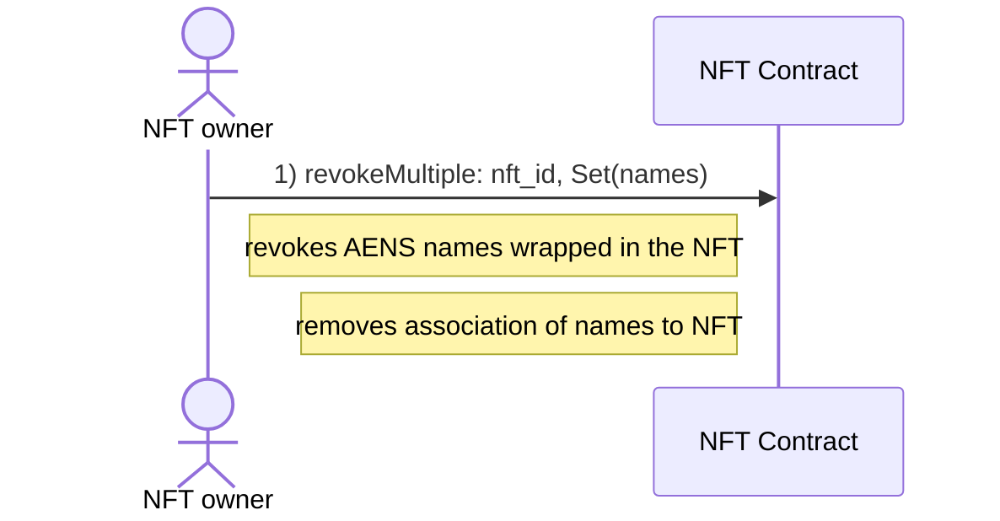
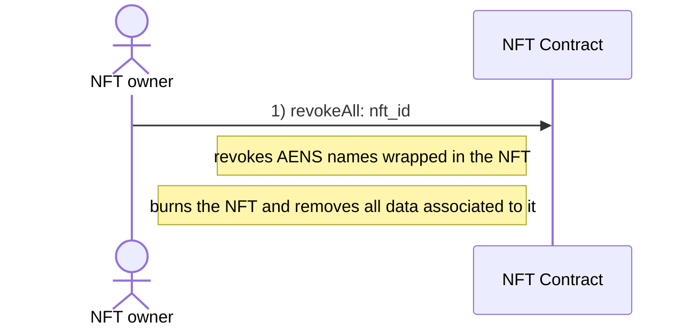

# Revoke AENS names

## Single name

```mermaid
sequenceDiagram
    actor NFT owner
    NFT owner ->> NFT Contract: 1) revokeSingle: nft_id, name
    Note left of NFT Contract: revokes AENS name wrapped in the NFT
    Note left of NFT Contract: removes association of name to NFT
```

**Considerations**

- How to reward users for extending?

## Multiple names

```mermaid
sequenceDiagram
    actor NFT owner
    NFT owner ->> NFT Contract: 1) revokeMultiple: nft_id, Set(names)
    Note left of NFT Contract: revokes AENS names wrapped in the NFT
    Note left of NFT Contract: removes association of names to NFT
```

**Considerations**

- How to reward users for extending?

## All names

```mermaid
sequenceDiagram
    actor NFT owner
    NFT owner ->> NFT Contract: 1) revokeAll: nft_id
    Note left of NFT Contract: revokes AENS names wrapped in the NFT
    Note left of NFT Contract: burns the NFT and removes all data associated to it
```
