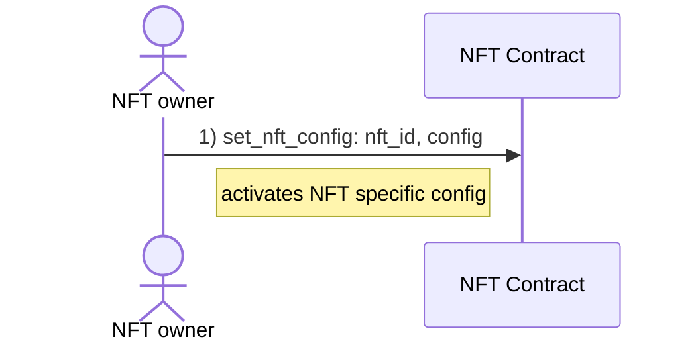

# Reward users for extending names

By default, rewarding users for extending names wrapped in NFTs will not be activated.

For rewarding, we distinguish between a global reward config and an NFT specific reward config. This allows users to provide higher rewards for specific NFTs that contain AENS names which they consider more valuable than others and vice versa.

The global config is defined by an account and will be applied on all NFTs this account owns.

NFT specific config always overrules the global reward-config.

When an NFT is transferred to another account, the NFT specific reward-config will be removed.

## Config

- `reward` the amount of Æ (in ættos) to be distributed, if a user extends names wrapped in an NFT in the regular `reward_block_window`
- `reward_block_window` the window (in keyblocks) before name expiration where the defined `reward` is paid
- `emergency_reward` the amount of Æ (in ættos) to be distributed, if a user extends names wrapped in an NFT in the `emergency_reward_block_window`
- `emergency_reward_block_window` the window (in keyblocks) before name expiration where the defined `emergency_reward` is paid
- `can_receive_from_others` defines if a users allows his NFTs to receive and wrap AENS names from others
- `burnable_if_empty`

**Note**

- `estimate_reward` entrypoint calculates the reward based on the expiration date of the names wrapped in an NFT, considering the global config (or the NFT specific config if set) and the amount of Æ deposited by the NFT owner
   - in case the deposited Æ amount of the NFT owner is lower than `reward` or `emergency_reward`, the remaining Æ are returned

## Set global config

## Remove global config

## Set NFT specific config

## Remove NFT specific reward config

## Deposit to reward pool

## Withdraw reward balance

