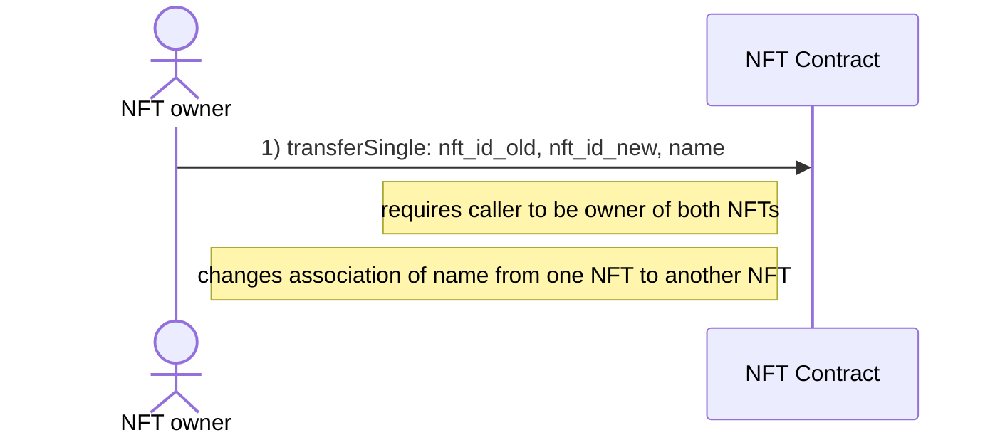
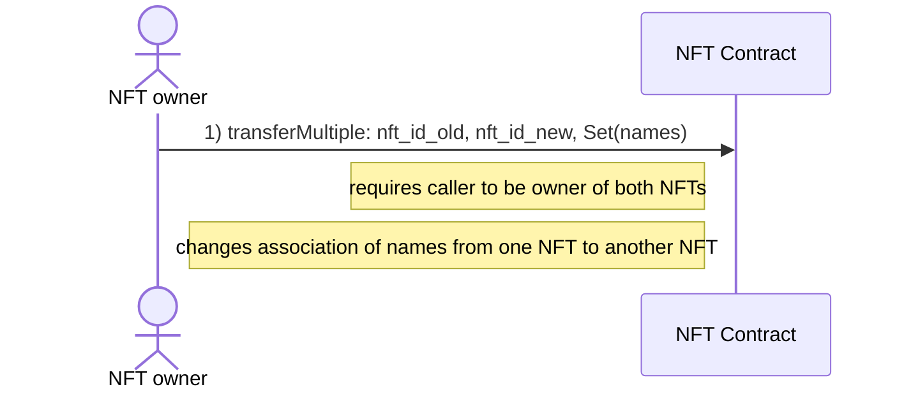
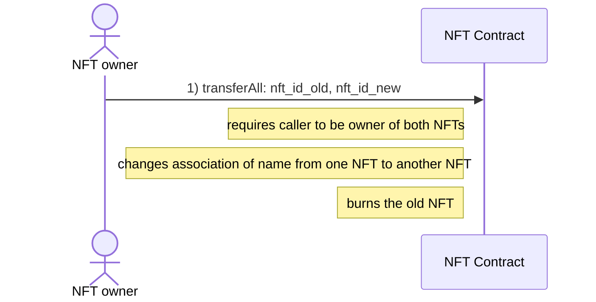

# Transfer AENS names

## Single name

## Multiple names

## All names

**Considerations**

- Allow to transfer AENS names to NFTs owned by other accounts?
    - Users could define per NFT if they want to allow this
    - By default this would not be allowed to prevent spamming NFTs with (unwanted) AENS names