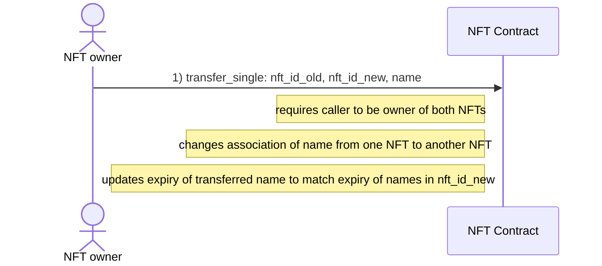
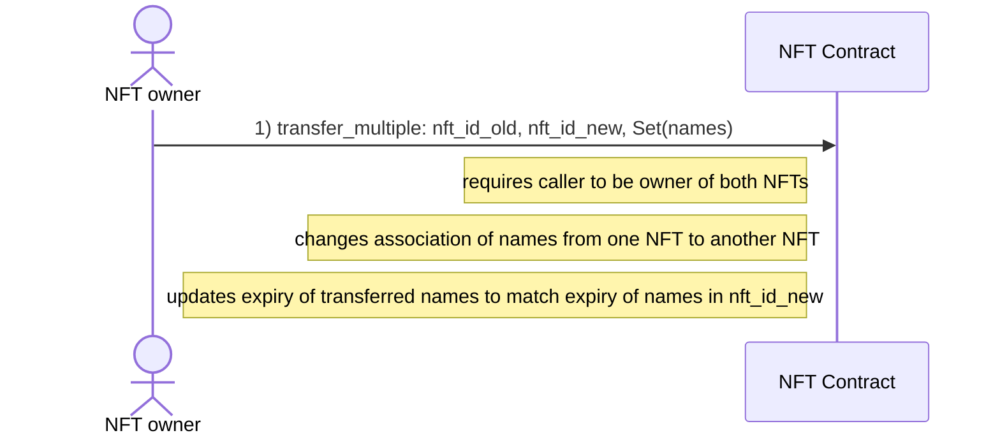
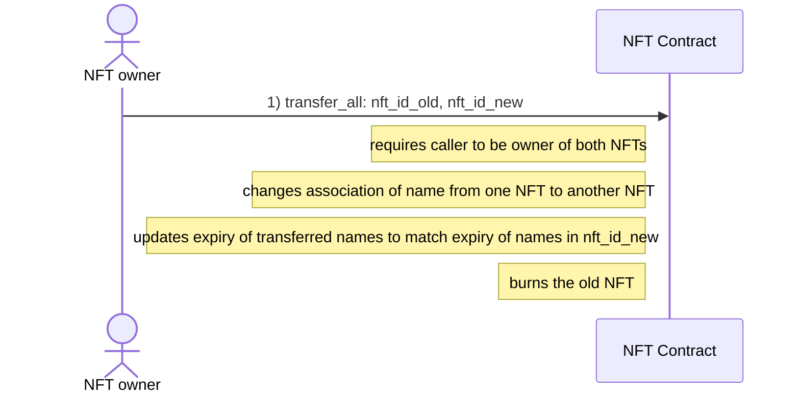

# Transfer AENS names

## Single name

## Multiple names

## All names

**Note:**

- Users can define via config on a global or NFT specific level if they want to allow receiving AENS names from others
    - By default this is not allowed to prevent spamming NFTs with (unwanted) AENS names