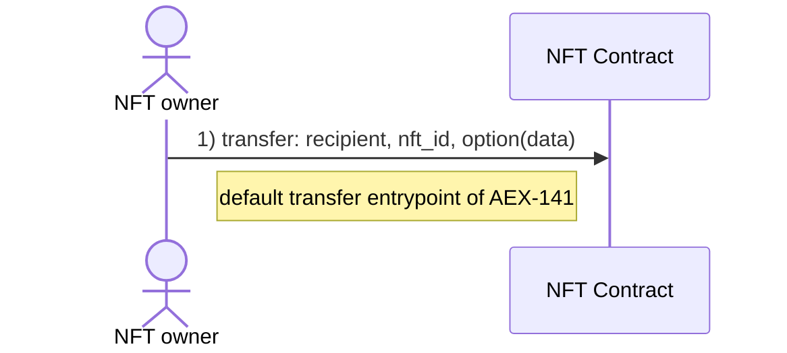
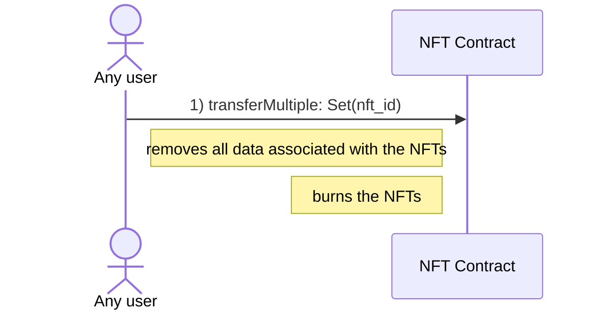

# Transfer NFTs

## Single

```mermaid
sequenceDiagram
    actor NFT owner
    NFT owner ->> NFT Contract: 1) transfer: recipient, nft_id, option(data)
    Note left of NFT Contract: default transfer entrypoint of AEX-141
```

## Multiple

```mermaid
sequenceDiagram
    actor Any user
    Any user ->> NFT Contract: 1) transferMultiple: Set(nft_id)
    Note left of NFT Contract: removes all data associated with the NFTs
    Note left of NFT Contract: burns the NFTs
```
