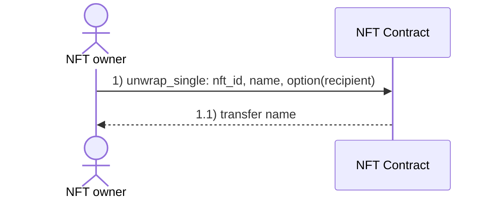
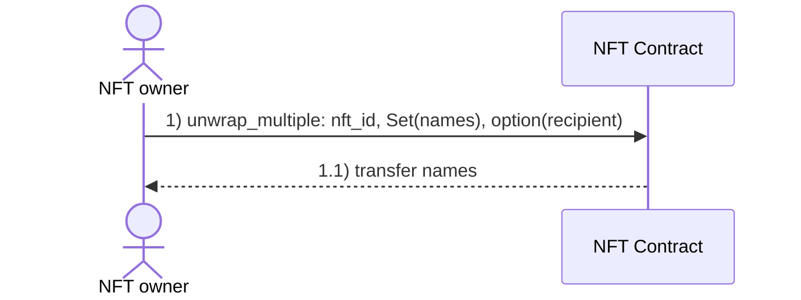
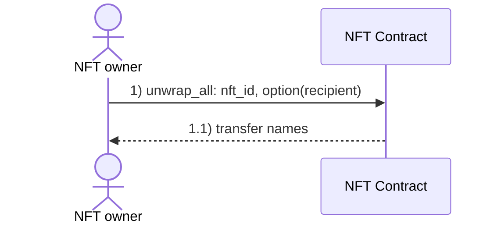

# Unwrap AENS names

## Single name

```mermaid
sequenceDiagram
    actor NFT owner
    NFT owner ->> NFT Contract: 1) unwrap_single: nft_id, name, option(recipient)
    NFT Contract -->> NFT owner: 1.1) transfer name
```

## Multiple names

```mermaid
sequenceDiagram
    actor NFT owner
    NFT owner ->> NFT Contract: 1) unwrap_multiple: nft_id, Set(names), option(recipient)
    NFT Contract -->> NFT owner: 1.1) transfer names
```

## All names

```mermaid
sequenceDiagram
    actor NFT owner
    NFT owner ->> NFT Contract: 1) unwrap_all: nft_id, option(recipient)
    NFT Contract -->> NFT owner: 1.1) transfer names
```

**Note:**

- If no recipient is defined, the names will be returned to the owner of the NFT calling the unwrap entrypoint