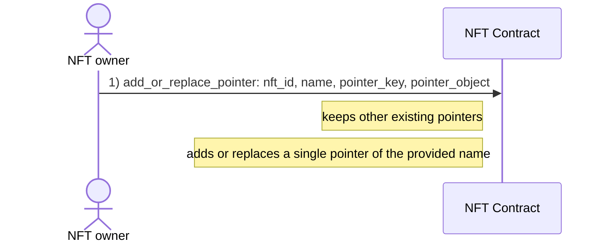
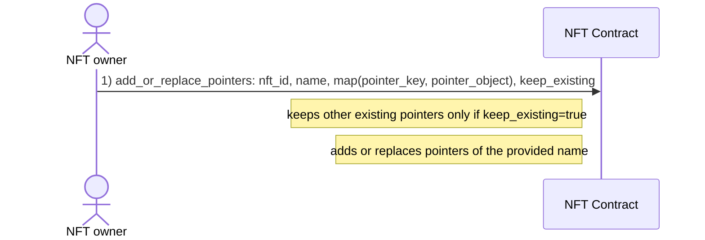
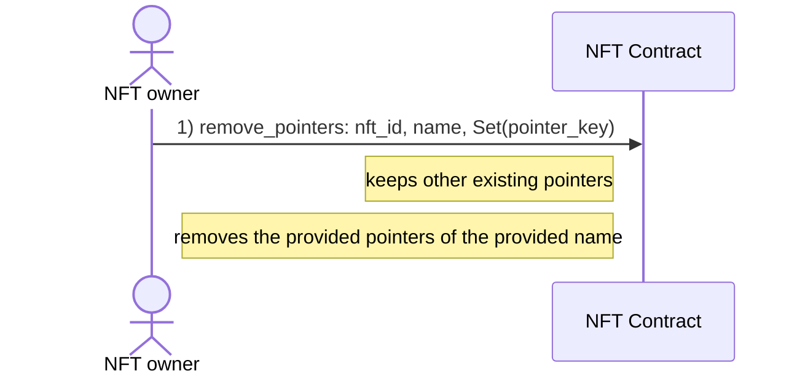

# Update pointers of AENS names

## Add a single pointer

```mermaid
sequenceDiagram
    actor NFT owner
    NFT owner ->> NFT Contract: 1) add_or_replace_pointer: nft_id, name, pointer_key, pointer_object
    Note left of NFT Contract: keeps other existing pointers
    Note left of NFT Contract: adds or replaces a single pointer of the provided name
```

## Add a set of pointers

```mermaid
sequenceDiagram
    actor NFT owner
    NFT owner ->> NFT Contract: 1) add_or_replace_pointers: nft_id, name, map(pointer_key, pointer_object), keep_existing
    Note left of NFT Contract: keeps other existing pointers only if keep_existing=true
    Note left of NFT Contract: adds or replaces pointers of the provided name
```

## Remove a single pointer

```mermaid
sequenceDiagram
    actor NFT owner
    NFT owner ->> NFT Contract: 1) remove_pointer: nft_id, name, pointer_key
    Note left of NFT Contract: keeps other existing pointers
    Note left of NFT Contract: removes the provided pointer of the provided name
```

## Remove multiple pointers

```mermaid
sequenceDiagram
    actor NFT owner
    NFT owner ->> NFT Contract: 1) remove_pointers: nft_id, name, Set(pointer_key)
    Note left of NFT Contract: keeps other existing pointers
    Note left of NFT Contract: removes the provided pointers of the provided name
```

## Remove all pointers

```mermaid
sequenceDiagram
    actor NFT owner
    NFT owner ->> NFT Contract: 1) remove_all_pointers: nft_id, name
    Note left of NFT Contract: removes the provided pointer of the provided name
```