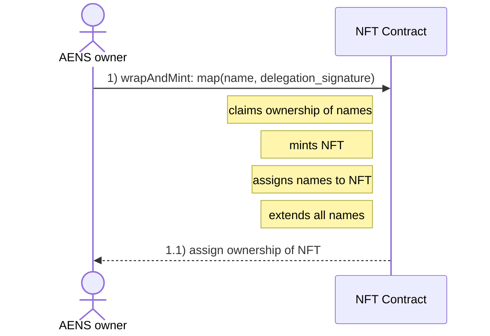
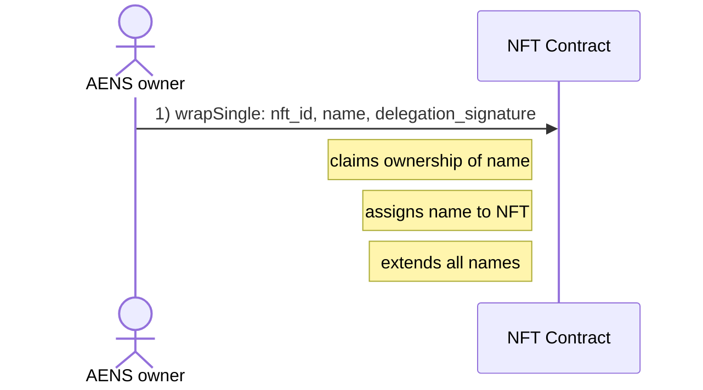
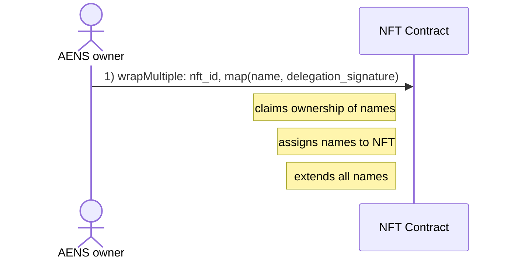

# Wrap AENS names

## Wrap names by minting a new NFT

**Considerations**

- Delegation signature needs to be created in advance for each AENS name.
    - In the future it will be possible to give a contract permission to handle all AENS names owned by an account, see: [https://github.com/aeternity/aeternity/issues/4080](https://github.com/aeternity/aeternity/issues/4080)

## Wrap name into existing NFT

## Wrap multiple names into existing NFT
