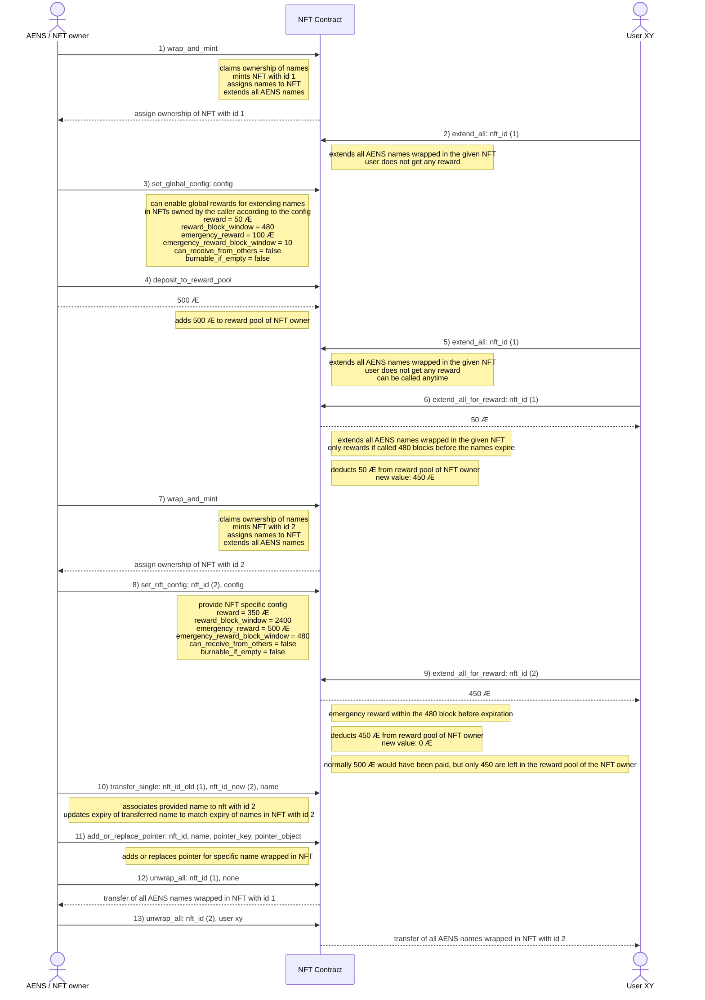

# Introduction
The work in this repository is part of a [grant approved by the æternity crypto foundation](https://forum.aeternity.com/t/active-wrapping-aens-names-into-aex-141-nfts).

## Before the grant (status quo)

* No batch actions (updates, transfers) for AENS names are possible
* No trading of AENS names possible
* Users still suffer from name expiration as they fail to consistently track name expiration

## After the grant (result of this work)

Wrapping AENS names into NFTs will make it easy to perform batch-actions on the names and enable new use cases. NFT trading is also highly anticipated and is another topic to tackle in that regards.

The results of the work in this grant will:

* provide a way for the community to better manage their AENS names
* enable batch-actions for AENS names
* allow strangers to extend AENS names and get rewarded for that
* make AENS names easily tradable on NFT marketplaces

## Full example sequence

## Sponsors

This work is sponsored by the [æternity crypto foundation](https://www.aeternity-foundation.org).

Do you also wanna sponsor this work? Send some Æ coins to:

- `buymeacoffee.chain` or
- `ak_3mw4DAv1mbo8XbEjTgt8UgWTgGJoNmiRnvCywz4BD6192kHtm`